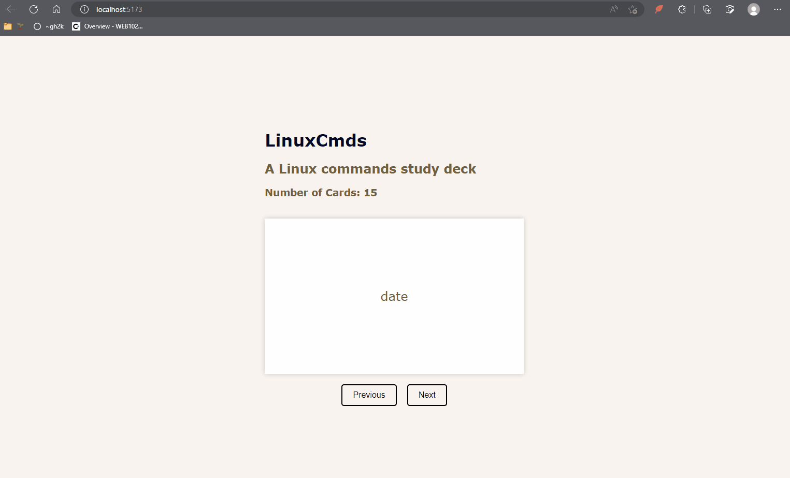
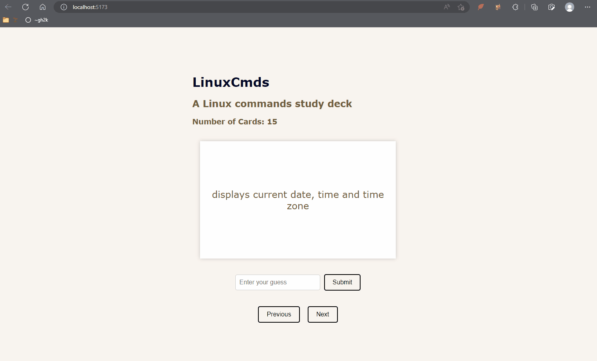

# Web Development Project 2 - *LinuxCmds*

Submitted by: **Gustavo Hernandez**

This web app: **A Linux commands study deck**

Time spent: **10** hours spent in total

## Required Features

The following **required** functionality is completed:

- [✅] **The title of the card set and some information about it, such as a short description and the total number of cards are displayed**
- [✅] **A single card at a time is displayed, only showing one of the components of the information pair**
- [✅] **A list of card pairs is created**
- [✅] **Clicking on the card shows the corresponding component of the information pair**
- [✅] **Clicking the next button displays a random new card**

The following **optional** features are implemented:

- [ ] Cards contains images in addition to or in place of text
- [ ] Cards have different visual styles such as color based on their category
  - [ ] *visual style implemented*

The following **additional** features are implemented:

* [ ] List anything else that you added to improve the site's functionality!

## Video Walkthrough

Here's a walkthrough of implemented required features:

<!-- Replace this with whatever GIF tool you used! -->
GIF created with [ScreenToGif](https://www.screentogif.com/) for Windows
<!-- Recommended tools:
[Kap](https://getkap.co/) for macOS
[ScreenToGif](https://www.screentogif.com/) for Windows
[peek](https://github.com/phw/peek) for Linux. -->

## Notes

Describe any challenges encountered while building the app.

- I had a bit of trouble understanding and implementing the useState() hook.
- ToDo
  - add more cards
  - change color theme
  - add answer input

## License

    Copyright [2023] [Gustavo Hernandez]

    Licensed under the Apache License, Version 2.0 (the "License");
    you may not use this file except in compliance with the License.
    You may obtain a copy of the License at

        http://www.apache.org/licenses/LICENSE-2.0

    Unless required by applicable law or agreed to in writing, software
    distributed under the License is distributed on an "AS IS" BASIS,
    WITHOUT WARRANTIES OR CONDITIONS OF ANY KIND, either express or implied.
    See the License for the specific language governing permissions and
    limitations under the License.

---

# Web Development Project 3 - *LinuxCmds*

Submitted by: **Gustavo Hernandez**

This web app: **A Linux commands study deck - now with user input!**

Time spent: **5** hours spent in total

## Required Features

The following **required** functionality is completed:

- [✅] **The user can enter their guess in a box before seeing the flipside of the card**
- [✅] **Clicking on a submit button shows visual feedback about whether the answer was correct or incorrect**
- [✅] **A back button is displayed on the card and can be used to return to the previous card in a set sequence**
- [✅] **A next button is displayed on the card and can be used to navigate to the next card in a set sequence**

The following **optional** features are implemented:

- [ ] A shuffle button is used to randomize the order of the cards
- [ ] A user's answer may be counted as correct even when it is slightly different from the target answer
- [ ] A counter displays the user's current and longest streak of correct responses
- [ ] A user can mark a card that they have mastered and have it removed from the pool of answers as well as added to a list of mastered cards

The following **additional** features are implemented:

* [ ] List anything else that you added to improve the site's functionality!

## Video Walkthrough

Here's a walkthrough of implemented user stories:

<!-- Replace this with whatever GIF tool you used! -->
GIF created with [ScreenToGif](https://www.screentogif.com/) for Windows
<!-- Recommended tools:
[Kap](https://getkap.co/) for macOS
[ScreenToGif](https://www.screentogif.com/) for Windows
[peek](https://github.com/phw/peek) for Linux. -->

## Notes

Describe any challenges encountered while building the app.
- I had trouble alligning things to my liking
- Still have to add more cards 😅

## License

    Copyright [2023] [Gustavo Hernandez]

    Licensed under the Apache License, Version 2.0 (the "License");
    you may not use this file except in compliance with the License.
    You may obtain a copy of the License at

        http://www.apache.org/licenses/LICENSE-2.0

    Unless required by applicable law or agreed to in writing, software
    distributed under the License is distributed on an "AS IS" BASIS,
    WITHOUT WARRANTIES OR CONDITIONS OF ANY KIND, either express or implied.
    See the License for the specific language governing permissions and
    limitations under the License.